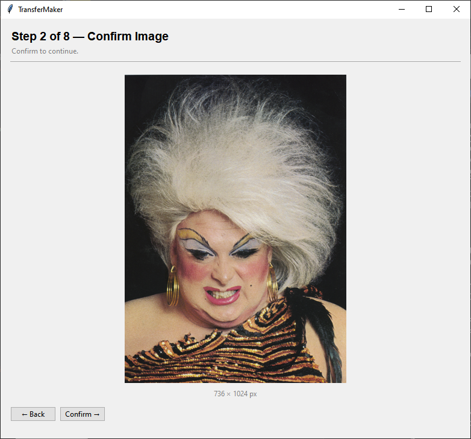
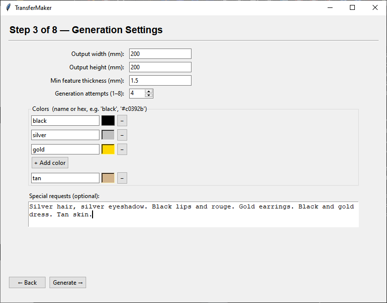
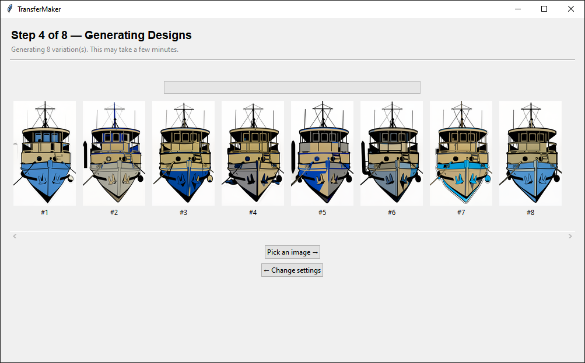
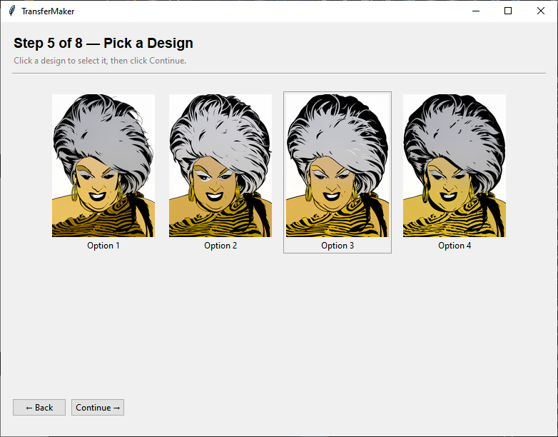
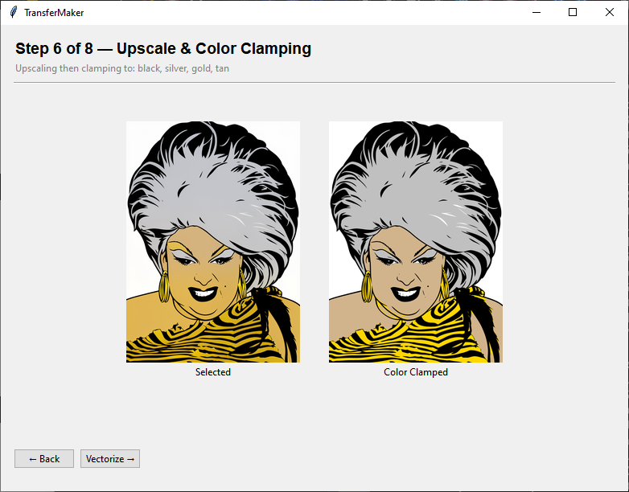
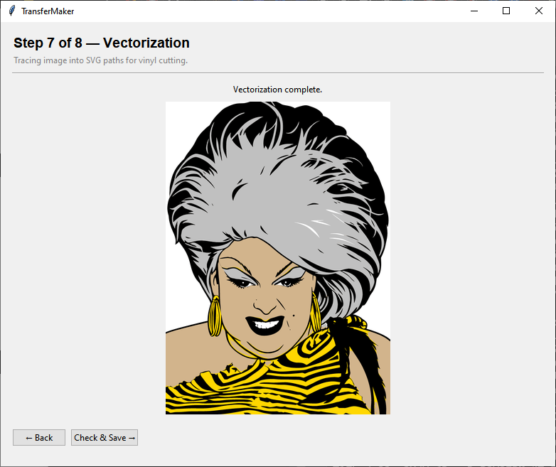
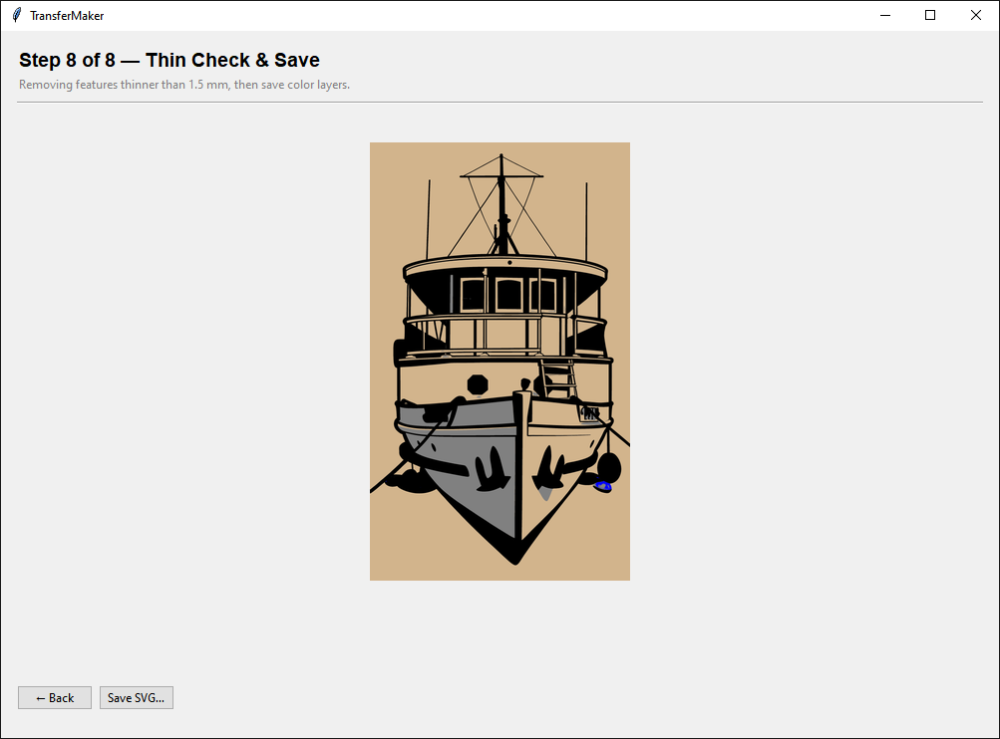
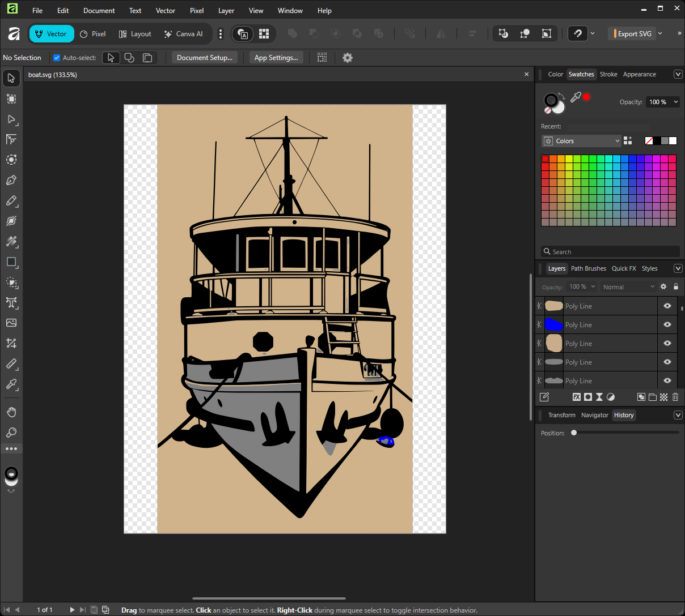
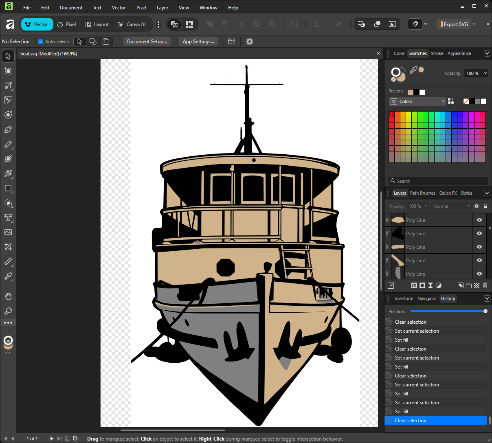

# TransferMaker

This application greatly simplifies the process of turning an image into a print.

## What Does This Do?

1. You give it an image 
2. You choose the colors you want and the output size and the minimum feature thickness
3. It will generate a set of images and you will choose the best one
4. It will upscale the image
4. It will clamp the colors to fit the ones you have chosen
5. It will vectorize the image
6. It will remove all features thinner than the minimum thickness you chosen
7. It will save the result as an svg file

What you do with it at that point is up to you.

## How Does This Work?

It uses a local AI inference engine which will download model weights to your computer and run an image editing AI model which processes the image initially. The rest of the processing is just regular boring computer code.

## Wait! Are you saying that you are using AI? I don't trust those AI companies!!

**No data leaves your computer at any time during this process!** The AI companies don't have any part in this. This is an open source model with a license that allows commercial use! You are good to go! But maybe read the license because I am not a lawyer and different countries have different rules. The model is named Flux 2 Klein 4B.

## What data are you collecting from me?

Nothing! You can uplug your router or turn off your wifi and it will still work! If you are tech savvy you can watch the network packets when it runs and except for files it needs to download the first time and checks for an update to the engine once on each start up you won't see the app talk to any computers outside of your network. 

## There has to be a catch!

There is, actually. You need a pretty beefy computer to run this, and an even beefier one to run it at any decent speed. Get an nvidia video card, 3000 series, 4000 series or 5000 series with at least 8GB of VRAM if you want to run it FAST. Otherwise you need at least 16GB of system RAM in your computer. Look, I know it sucks, but this thing is basically magic, so you can't really complain.

## Instructions

Click the green '<> Code' button towards the top of the page and select 'Download zip'. Extract the zip file to a directory and double click on 'run-windows.bat'. It will take a little while to download the AI and the inference engine (they are multiples of gigabytes), but you only have to do that once. When it is done loading just follow the directions in the UI window.

Don't forget to click on the star!

## Demo

Choose the image.

 

Specify size, feature thickness, colors, and requirements.

Wait a long time for generations.

Pick the best one.

 

Upscaling and color clamping (restricts to only base colors you specified).

Vectorize.

 

Remove thin features.

 

Open in vector image editor.

 

Make specific fixes and you are ready to print/cut.